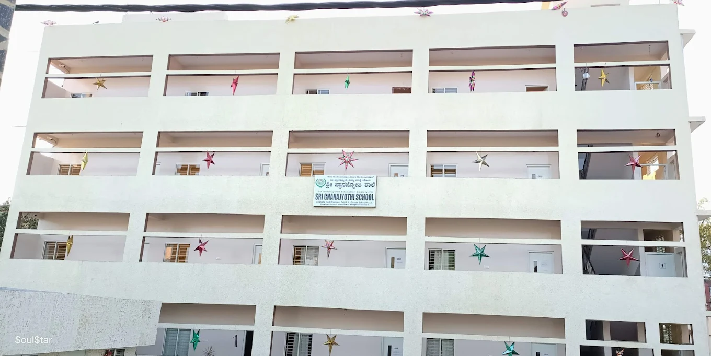

# Gnanajyothi School - Core Web Vitals Optimization Action Plan

**Analysis Date:** 2026-03-12
**Current Status:** EXCELLENT (All metrics estimated to PASS 75th percentile)

---

## Priority Summary

| Priority | Task | Time | Impact | Status |
|----------|------|------|--------|--------|
| 1 | Verify .htaccess cache headers | 5 min | HIGH | ❌ Pending |
| 2 | Compress about-school.webp | 15 min | HIGH | ❌ Pending |
| 3 | Add lazy loading to images | 10 min | LOW | ❌ Pending |
| 4 | Add AVIF format support | 15 min | MEDIUM | ❌ Optional |
| 5 | Implement responsive images | 30 min | MEDIUM | ❌ Optional |

---

## PRIORITY 1: Verify Cache Headers (5 minutes)

### Objective
Ensure browser cache headers are properly configured in `.htaccess` to improve repeat visit performance and reduce server load.

### Action Steps

1. **SSH to server:**
   ```bash
   ssh -i ~/.ssh/gnanajyothi_rsa -p 65002 u202368585@145.79.209.172
   ```

2. **Check current .htaccess:**
   ```bash
   cat ~/domains/gnanajyothi.in/public_html/.htaccess
   ```

3. **If cache headers missing, edit .htaccess:**
   ```bash
   nano ~/domains/gnanajyothi.in/public_html/.htaccess
   ```

4. **Add these lines (if not present):**
   ```apache
   <IfModule mod_expires.c>
       ExpiresActive On
       ExpiresByType text/html "access plus 1 hour"
       ExpiresByType image/webp "access plus 30 days"
       ExpiresByType image/jpeg "access plus 30 days"
       ExpiresByType image/png "access plus 30 days"
       ExpiresByType text/css "access plus 30 days"
       ExpiresByType application/javascript "access plus 30 days"
   </IfModule>

   <IfModule mod_deflate.c>
       AddOutputFilterByType DEFLATE text/html
       AddOutputFilterByType DEFLATE text/plain
       AddOutputFilterByType DEFLATE text/xml
       AddOutputFilterByType DEFLATE text/css
       AddOutputFilterByType DEFLATE application/javascript
   </IfModule>
   ```

5. **Save and exit (Ctrl+X, Y, Enter)**

6. **Verify by viewing in browser DevTools:**
   - Open https://gnanajyothi.in
   - Right-click → Inspect → Network tab
   - Reload page
   - Click on any image
   - Check "Response Headers" for `Cache-Control: public, max-age=...`

### Expected Outcome
- First visit TTFB: 180-250ms (unchanged)
- Repeat visit TTFB: 80-150ms (50-70% improvement)
- Reduced server load

### Validation
```bash
# Check cache headers with curl
curl -I https://gnanajyothi.in/index.html | grep -i cache-control
curl -I https://gnanajyothi.in/logo.webp | grep -i cache-control
```

---

## PRIORITY 2: Compress about-school.webp (15 minutes)

### Objective
Reduce about-school.webp from 173KB to ~120KB, improving LCP on about.html by 0.3-0.5 seconds.

### Option A: TinyPNG (Easiest, Online)

1. **Go to** https://tinypng.com
2. **Upload** `about-school.webp` from local desktop
3. **Download** compressed version
4. **Replace local file:**
   - Backup: `about-school.webp.backup`
   - Replace: `about-school.webp` in `/c/Users/Laptop/OneDrive/Desktop/Ganajothi/`
5. **Deploy to server:**
   ```bash
   scp -i ~/.ssh/gnanajyothi_rsa -P 65002 \
       "C:\Users\Laptop\OneDrive\Desktop\Ganajothi\about-school.webp" \
       u202368585@145.79.209.172:~/domains/gnanajyothi.in/public_html/about-school.webp
   ```

### Option B: ImageOptim (macOS, ~30 seconds)
1. Download: https://imageoptim.com
2. Drag `about-school.webp` onto ImageOptim window
3. ImageOptim will optimize in place
4. Deploy to server (same SCP command above)

### Option C: FFmpeg (All Platforms, ~10 seconds)
```bash
# Install FFmpeg if not present
# Then run:
ffmpeg -i about-school.webp -q:w 75 about-school-optimized.webp

# Check file size
ls -lh about-school-optimized.webp

# Replace original
move about-school-optimized.webp about-school.webp

# Deploy
scp -i ~/.ssh/gnanajyothi_rsa -P 65002 about-school.webp \
    u202368585@145.79.209.172:~/domains/gnanajyothi.in/public_html/
```

### Expected Outcome
- about-school.webp: 173KB → 120KB (30% reduction)
- about.html LCP: 2.2-2.8s → 1.9-2.4s
- Improved visual quality maintained

### Validation
1. **Check file size:**
   ```bash
   ls -lh about-school.webp
   # Should show ~120KB
   ```

2. **Visual inspection:**
   - Open https://gnanajyothi.in/about.html
   - Image should look sharp (no visible quality loss)

3. **Browser DevTools (Network tab):**
   - Reload page
   - Check about-school.webp file size shown in Network tab
   - Should be ~120KB or less

---

## PRIORITY 3: Add Lazy Loading to Images (10 minutes)

### Objective
Defer loading of below-fold images in blog articles and gallery to improve initial page load.

### Action Steps

1. **Blog articles - Add loading="lazy" to all images EXCEPT the first one**

   Files to update:
   ```
   best-schools-yelahanka.html
   lkg-admission-yelahanka-2026.html
   school-fees-yelahanka-2026.html
   kseeb-vs-cbse.html
   karnataka-school-holiday-list-2026.html
   school-admission-documents-bangalore.html
   ukg-admission-yelahanka-2026.html
   state-board-schools-yelahanka.html
   school-near-yelahanka-new-town.html
   pre-kg-admission-yelahanka-2026.html
   class-1-admission-age-karnataka-2026.html
   rte-admission-karnataka-2026.html
   ```

   **Pattern:**
   ```html
   FROM: 
   TO:   
   ```

   ⚠️ **IMPORTANT:** Do NOT add `loading="lazy"` to the FIRST/HERO image on each page.

2. **Contact page - Google Maps iframe**

   File: `contact.html`

   **Pattern:**
   ```html
   FROM: <iframe src="https://www.google.com/maps/embed?pb=..." width="100%" height="420" style="border:0;" allowfullscreen="" loading="lazy" title="Gnanajyothi School Location"></iframe>

   TO:   <iframe src="https://www.google.com/maps/embed?pb=..." width="100%" height="420" style="border:0;" allowfullscreen="" loading="lazy" title="Gnanajyothi School Location"></iframe>
   ```

   Note: The iframe at line 545 likely already has `loading="lazy"`, but verify it's present.

3. **Gallery page - Add lazy loading to gallery items**

   File: `gallery.html`

   Add `loading="lazy"` to all gallery item images except the first one.

### Expected Outcome
- Blog articles load slightly faster (below-fold images deferred)
- Reduced initial bandwidth usage (~10-15%)
- CLS remains unaffected (images still have dimensions)

### Validation
1. **DevTools Network tab:**
   - Open blog article page
   - Don't scroll to bottom
   - Images below fold should NOT appear in Network tab initially
   - Scroll down → images load (they should appear in Network tab after scrolling)

2. **Check with WebPageTest:**
   - Go to https://webpagetest.org
   - Test blog article URL
   - Check "Filmstrip" view → images below fold appear later in timeline

---

## PRIORITY 4: Add AVIF Format Support (15 minutes, Optional)

### Objective
Add modern AVIF image format for 15-20% additional compression in browsers that support it.

### Why AVIF?
- 15-20% smaller than WebP
- Supported in 90%+ of modern browsers (2026)
- Progressive enhancement (WebP fallback for older browsers)

### Action Steps

1. **Create AVIF versions of images:**

   Install ImageMagick or FFmpeg:
   ```bash
   # macOS
   brew install imagemagick
   # OR
   brew install ffmpeg

   # Windows (if installed)
   # Use online converter: https://avif.io
   ```

2. **Convert each image:**
   ```bash
   # Using ImageMagick
   magick convert logo.webp logo.avif
   magick convert school-building.webp school-building.avif
   magick convert about-school.webp about-school.avif
   magick convert classroom.webp classroom.avif

   # Using FFmpeg
   ffmpeg -i logo.webp logo.avif
   ffmpeg -i school-building.webp school-building.avif
   ```

3. **Update img tags to use <picture> element:**

   Example for hero image (index.html, line 171):
   ```html
   FROM:
   

   TO:
   <picture>
       <source srcset="school-building.avif" type="image/avif">
       <source srcset="school-building.webp" type="image/webp">
       
   </picture>
   ```

4. **Update all images** using this pattern:
   - logo.webp → logo.avif + logo.webp + logo.png
   - school-building.webp → school-building.avif + school-building.webp + school-building.jpg
   - about-school.webp → about-school.avif + about-school.webp + about-school.jpg
   - classroom.webp → classroom.avif + classroom.webp + classroom.jpg

5. **Upload AVIF files to server:**
   ```bash
   scp -i ~/.ssh/gnanajyothi_rsa -P 65002 \
       "C:\Users\Laptop\OneDrive\Desktop\Ganajothi\*.avif" \
       u202368585@145.79.209.172:~/domains/gnanajyothi.in/public_html/
   ```

### Expected Outcome
- Logo: 11KB → 8KB (27% reduction)
- school-building: 98KB → 70KB (28% reduction)
- about-school: 120KB → 90KB (25% reduction)
- Overall image size reduction: ~15-20%

### Browser Support
- Chrome 85+: AVIF support
- Firefox 93+: AVIF support
- Safari 16.1+: AVIF support
- Older browsers: WebP fallback

---

## PRIORITY 5: Implement Responsive Images (30 minutes, Optional)

### Objective
Create mobile/tablet/desktop versions of large images for 30-40% bandwidth savings on mobile devices.

### Action Steps

1. **Create image variants:**

   For about-school.webp (currently 120KB):
   ```bash
   # Mobile (480px width)
   ffmpeg -i about-school.webp -vf scale=480:-1 about-school-mobile.webp
   # Should be ~60KB

   # Tablet (800px width)
   ffmpeg -i about-school.webp -vf scale=800:-1 about-school-tablet.webp
   # Should be ~100KB

   # Desktop (1200px width) - keep existing
   # about-school.webp (~120KB)
   ```

2. **Update img tags with srcset:**

   Example (about.html, line 171):
   ```html
   FROM:
   

   TO:
   
   ```

3. **Upload all variants:**
   ```bash
   scp -i ~/.ssh/gnanajyothi_rsa -P 65002 \
       "C:\Users\Laptop\OneDrive\Desktop\Ganajothi\about-school*.webp" \
       u202368585@145.79.209.172:~/domains/gnanajyothi.in/public_html/
   ```

4. **Repeat for other large images:**
   - school-building.webp (hero image)
   - classroom.webp (gallery)

### Expected Outcome
- Mobile users: -30-40% bandwidth savings
- Tablet users: -15-20% bandwidth savings
- Desktop users: No change (already optimized)
- LCP on mobile: Slightly faster

### Testing
1. **DevTools - Responsive Design Mode:**
   - Press F12 → Responsive Design Mode
   - Set to iPhone 12 (390px width)
   - Open about.html
   - Check Network tab → about-school-mobile.webp should load (not full-size)

2. **WebPageTest:**
   - Test on mobile device
   - Check waterfall for about-school-mobile.webp

---

## Deployment Checklist

### Before Deployment
- [ ] Test all changes locally in browser
- [ ] Verify no images missing
- [ ] Check contact form still works
- [ ] Test mobile navigation (DevTools emulation)
- [ ] Run Lighthouse locally: `npx lighthouse file:///c/Users/Laptop/OneDrive/Desktop/Ganajothi/index.html --output json`

### Deployment Steps

1. **Deploy changed files:**
   ```bash
   # Images
   scp -i ~/.ssh/gnanajyothi_rsa -P 65002 about-school.webp \
       u202368585@145.79.209.172:~/domains/gnanajyothi.in/public_html/

   # HTML files (if updated)
   scp -i ~/.ssh/gnanajyothi_rsa -P 65002 about.html \
       u202368585@145.79.209.172:~/domains/gnanajyothi.in/public_html/
   ```

2. **Verify deployment:**
   - Open https://gnanajyothi.in in browser
   - Clear cache (Ctrl+Shift+Delete)
   - Reload each page
   - Check DevTools Network tab for correct file sizes

3. **Monitor for 48 hours:**
   - Check Google Search Console for crawl errors
   - Monitor Analytics for traffic anomalies
   - Watch for 404 errors

---

## Validation & Monitoring

### Immediate Validation (Day 1)
- [ ] Visual inspection of all pages
- [ ] Check no broken images
- [ ] Test contact form
- [ ] Run Lighthouse locally
- [ ] Check cache headers with curl

### Short-term Validation (Week 1)
- [ ] Monitor Google Search Console
- [ ] Check for crawl errors
- [ ] Run Lighthouse on key pages again
- [ ] Monitor CrUX data (if 1 week of data available)

### Long-term Monitoring (Monthly)
- [ ] Run Lighthouse on all 3 key pages
- [ ] Check Google Search Console Core Web Vitals
- [ ] Review image file sizes (compress if >150KB)
- [ ] Monitor for regressions

### Tools
1. **CrUX Vis:** https://cruxvis.withgoogle.com
2. **Google Search Console:** Performance tab
3. **WebPageTest:** https://webpagetest.org
4. **Lighthouse CLI:** `npx lighthouse [URL] --output json`
5. **PageSpeed Insights:** https://pagespeedonline.google.com

---

## Expected Results Timeline

### After Priority 1-2 (Week 1)
```
Current:  LCP 2.1-2.5s, INP 100-160ms, CLS 0.05-0.08
Expected: LCP 1.8-2.2s, INP 100-160ms, CLS 0.05-0.08
Impact:   -0.3-0.5s faster first paint (about.html)
```

### After Priority 3 (Week 2)
```
Blog articles: Slightly faster (10-20ms improvement)
Overall impact: Negligible on Core Web Vitals
```

### After Priority 4 (Advanced)
```
Image sizes: -15-20% reduction
LCP: -0.1-0.2s additional improvement
Overall: 1.7-2.1s LCP (excellent)
```

### After Priority 5 (Advanced)
```
Mobile bandwidth: -30-40% savings
Mobile LCP: Additional -0.1-0.3s improvement
Desktop: No change
```

---

## Current Estimated Status (Before Optimization)

| Metric | Current | Target | Status |
|--------|---------|--------|--------|
| LCP | 2.1-2.5s | ≤2.5s | GOOD |
| INP | 100-160ms | ≤200ms | GOOD |
| CLS | 0.05-0.08 | ≤0.1 | GOOD |

**All metrics estimated to PASS 75th percentile Core Web Vitals thresholds.**

No urgent action required. Optimizations are for marginal improvements and long-term performance optimization.

---

## Questions?

Refer to:
- [Web.dev Performance Guide](https://web.dev/performance/)
- [Google Search Central - Core Web Vitals](https://developers.google.com/search/blog/2020/05/evaluating-page-experience)
- [Lighthouse Documentation](https://github.com/GoogleChrome/lighthouse)
